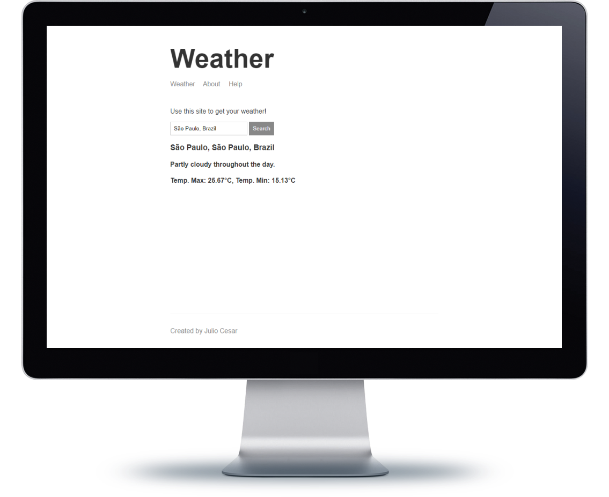

# Aplicação MVC que informa o tempo

###### Aplicação contruída através do curso da Udemy: The Complete Node.js Developer Course (3rd Edition)

*Aplicação recebe um endereço e retorna os dados sobre o clima naquela determinada região.*

**#Node.js, #Handlebars, #MVC**

